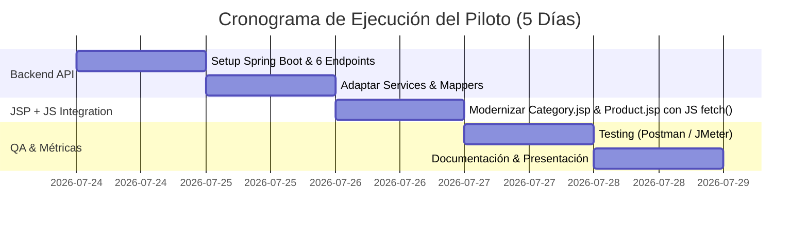

# Plan 1: Modernización Arquitectónica API-First (JPetStore)
> **Basado en:** [Pitch de Arquitectura (index (1) (1).html)](file:///C:/Users/carlo/Downloads/index%20%281%29%20%281%29.html)  
> **Objetivo:** Transformar el monolito acoplado JPetStore en una arquitectura desacoplada API-First. En el frontend, se modernizan las plantillas JSP existentes ([d:\jpetstore-6](file:///D:/jpetstore-6)) inyectando JavaScript `fetch()` para consumir la nueva API Spring Boot ([d:\jpetstore-partial](file:///D:/jpetstore-partial)) manteniendo el diseño y CSS actual.

---

## 1. Resumen Ejecutivo y Visión TO-BE

El sistema legacy JPetStore ([d:\jpetstore-6](file:///D:/jpetstore-6)) opera sobre una pila tecnológica acoplada (Stripes Framework + JSP + HSQLDB embebida) donde la presentación, la lógica y el acceso a datos viven encadenados en un único servidor.

### Estrategia de Modernización Híbrida (Strangler Fig)

```
 ┌────────────────────────────────────────────────────────┐
 │           Vistas JSP Existentes (d:\jpetstore-6)       │
 │   • Mantiene CSS, Header, Footer y maquetación actual   │
 │   • Reemplaza renderizado servidor (<c:forEach>) por   │
 │     llamadas JavaScript client-side (fetch())           │
 └──────────────────────────┬─────────────────────────────┘
                            │ REST API (JSON sobre HTTP)
                            ▼
 ┌────────────────────────────────────────────────────────┐
 │     Backend Moderno (d:\jpetstore-partial)             │
 │     • Java 17 + Spring Boot 3.x                        │
 │     • Controller Layer: RestControllers (@CrossOrigin)  │
 │     • Service Layer: CatalogService (Reutilizado)      │
 │     • Data Access Layer: ProductMapper (MyBatis)       │
 └──────────────────────────┬─────────────────────────────┘
                            │ SQL Queries (SELECT)
                            ▼
 ┌────────────────────────────────────────────────────────┐
 │                 Base de Datos Target                   │
 │                 PostgreSQL                             │
 └────────────────────────────────────────────────────────┘
```

---

## 2. Alcance del Piloto: Product Catalog Service

Para minimizar el riesgo y validar la arquitectura en producción sin afectar transacciones ni pagos, el piloto se enfoca en el **Product Catalog Service** (módulo de solo lectura).

### Los 6 Endpoints del Piloto
| # | Método | Endpoint | Vista JSP Target (`jpetstore-6`) |
|---|---|---|---|
| **1** | `GET` | `/api/catalog/categories` | `Main.jsp` / Navigation Header |
| **2** | `GET` | `/api/catalog/categories/{id}/products` | `Category.jsp` |
| **3** | `GET` | `/api/catalog/products/{id}` | `Product.jsp` |
| **4** | `GET` | `/api/catalog/products/{id}/items` | `Product.jsp` (Tabla de Items) |
| **5** | `GET` | `/api/catalog/items/{id}` | `Item.jsp` |
| **6** | `GET` | `/api/catalog/products/search?keyword=` | `SearchProducts.jsp` |

---

## 3. Impacto Esperado y Métricas Cuantitativas

| Métrica | Estado Actual (Baseline) | Estado Objetivo (Piloto) | Mejora |
|---|---|---|---|
| **Latencia (GET)** | 450 ms | 120 ms | **-73%** |
| **Acoplamiento Temporal** | 100% | 10% | **-90%** |
| **Code Health Score** | 35 / 100 | 85 / 100 | **+140%** |
| **Time-to-Market (UI)** | 30 días | 3 días | **-90%** |
| **Escalabilidad** | 1x | 5x+ | **+400%** |
| **Reutilización de UI Actual** | 0% | 100% | **100% Consistencia Visual** |

---

## 4. Plan de Ejecución (Sprint de 5 Días)



---

## 5. Componentes Técnicos y Código de Integración JSP

### Modernización de `Category.jsp` con JavaScript `fetch()`
```jsp
<%@ include file="../common/IncludeTop.jsp"%>

<div id="BackLink">
  <a href="Main.action">Return to Main Menu</a>
</div>

<div id="Catalog">
  <h2 id="category-title">Cargando Categoría...</h2>

  <table>
    <thead>
      <tr>
        <th>Product ID</th>
        <th>Name</th>
      </tr>
    </thead>
    <tbody id="product-list-body">
      <!-- Rellenado dinámicamente vía fetch() -->
    </tbody>
  </table>
</div>

<script>
document.addEventListener('DOMContentLoaded', async () => {
    const params = new URLSearchParams(window.location.search);
    const categoryId = params.get('categoryId') || 'FISH';

    try {
        const response = await fetch(`http://localhost:8080/api/catalog/categories/${categoryId}/products`);
        const products = await response.json();

        document.getElementById('category-title').innerText = categoryId;
        const tbody = document.getElementById('product-list-body');
        
        tbody.innerHTML = products.map(product => `
            <tr>
                <td><a href="Catalog.action?viewProduct=&productId=${product.productId}">${product.productId}</a></td>
                <td>${product.name}</td>
            </tr>
        `).join('');
    } catch (error) {
        console.error('Error al obtener productos de la API:', error);
    }
});
</script>

<%@ include file="../common/IncludeBottom.jsp"%>
```

---

## 6. Ventajas Clave de Inyectar JS en las JSPs Existentes

1. **Cero Rediseño de UI:** Mantiene exactamente las mismas hojas de estilo CSS, header, footer y layouts de `jpetstore-6`.
2. **Migración Incremental:** Permite transformar vista por vista (`Category.jsp`, `Product.jsp`, `Item.jsp`) sin romper las páginas aún no migradas.
3. **Descarga del Servidor Legacy:** Tomcat deja de realizar consultas a BD y bucles de renderizado server-side; el navegador solicita JSON directamente a la API Spring Boot.
