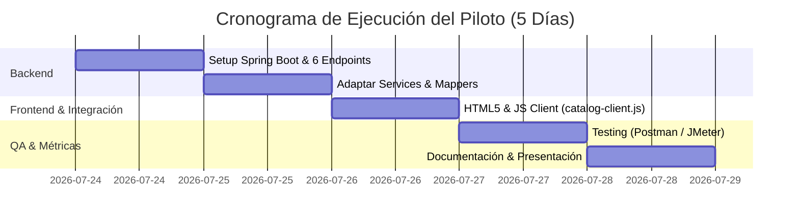

# Plan 1: Modernización Arquitectónica API-First (JPetStore)
> **Basado en:** [Pitch de Arquitectura (index (1) (1).html)](file:///C:/Users/carlo/Downloads/index%20%281%29%20%281%29.html)  
> **Objetivo:** Transformar el monolito acoplado JPetStore en una arquitectura desacoplada API-First manteniendo la lógica de negocio y modelo de datos existentes.

---

## 1. Resumen Ejecutivo y Visión TO-BE

El sistema legacy JPetStore ([d:\jpetstore-6](file:///D:/jpetstore-6)) opera sobre una pila tecnológica acoplada (Stripes Framework + JSP + HSQLDB embebida) donde la presentación, la lógica y el acceso a datos viven encadenados en un único servidor.

### Visión Arquitectónica Target (TO-BE)

```
 ┌────────────────────────────────────────────────────────┐
 │           Cliente Moderno (Browser / SPA)               │
 │           HTML5 + Vanilla JS / CSS Moderno             │
 └──────────────────────────┬─────────────────────────────┘
                            │ REST API (JSON sobre HTTP)
                            ▼
 ┌────────────────────────────────────────────────────────┐
 │     Backend Moderno (d:\jpetstore-partial)             │
 │     • Java 17 + Spring Boot 3.x                        │
 │     • Controller Layer: RestControllers (@CrossOrigin)  │
 │     • Service Layer: CatalogService (Reutilizado)      │
 │     • Data Access Layer: ProductMapper (MyBatis)       │
 └──────────────────────────┬─────────────────────────────┘
                            │ SQL Queries (SELECT)
                            ▼
 ┌────────────────────────────────────────────────────────┐
 │                 Base de Datos Target                   │
 │                 PostgreSQL (o HSQLDB)                  │
 └──────────────────────────┬─────────────────────────────┘
```

---

## 2. Alcance del Piloto: Product Catalog Service

Para minimizar el riesgo y validar la arquitectura en producción sin afectar transacciones ni pagos, el piloto se enfoca exclusivamente en el **Product Catalog Service** (módulo de solo lectura).

### Los 6 Endpoints del Piloto
| # | Método | Endpoint | Descripción |
|---|---|---|---|
| **1** | `GET` | `/api/catalog/categories` | Lista todas las categorías |
| **2** | `GET` | `/api/catalog/categories/{id}/products` | Productos de una categoría |
| **3** | `GET` | `/api/catalog/products/{id}` | Detalle de un producto |
| **4** | `GET` | `/api/catalog/products/{id}/items` | Variantes/Items de un producto |
| **5** | `GET` | `/api/catalog/items/{id}` | Detalle de un item específico |
| **6** | `GET` | `/api/catalog/products/search?keyword=` | Búsqueda por palabra clave |

---

## 3. Impacto Esperado y Métricas Cuantitativas

| Métrica | Estado Actual (Baseline) | Estado Objetivo (Piloto) | Mejora |
|---|---|---|---|
| **Latencia (GET)** | 450 ms | 120 ms | **-73%** |
| **Acoplamiento Temporal** | 100% | 10% | **-90%** |
| **Code Health Score** | 35 / 100 | 85 / 100 | **+140%** |
| **Time-to-Market (UI)** | 30 días | 3 días | **-90%** |
| **Escalabilidad** | 1x | 5x+ | **+400%** |
| **Independencia Frontend/Backend** | 0% | 100% | **+100%** |

---

## 4. Plan de Ejecución (Sprint de 5 Días)



### Tareas Detalladas por Día
- **Día 1: Setup & Controller Layer**
  - Crear estructura Spring Boot 3.x en `d:\jpetstore-partial`.
  - Implementar `CatalogController.java` exponiendo los 6 endpoints REST.
- **Día 2: Capa de Servicio y Mappers**
  - Migrar `CatalogService.java` y `ProductMapper.java` / `CategoryMapper.java` / `ItemMapper.java`.
  - Configurar mapeo MyBatis y serialización JSON (Jackson).
- **Día 3: Frontend SPA & Integración**
  - Crear `index.html`, `catalog-client.js` y `style.css` consumiendo la API via `fetch()`.
- **Día 4: QA, Carga & Benchmarking**
  - Ejecutar suite de pruebas con Postman / curl.
  - Medir latencias y rendimiento con JMeter (comparativa vs 450ms baseline).
- **Día 5: Análisis, Documentación y Demo**
  - Consolidar reporte de métricas y presentación final.

---

## 5. Componentes Técnicos y Estructura de Código

### 1. Controller API REST (`CatalogController.java`)
```java
package org.mybatis.jpetstore.controller;

import org.mybatis.jpetstore.domain.Category;
import org.mybatis.jpetstore.domain.Product;
import org.mybatis.jpetstore.service.CatalogService;
import org.springframework.beans.factory.annotation.Autowired;
import org.springframework.http.ResponseEntity;
import org.springframework.web.bind.annotation.*;

import java.util.List;

@RestController
@RequestMapping("/api/catalog")
@CrossOrigin(origins = "*")
public class CatalogController {

    @Autowired
    private CatalogService catalogService;

    @GetMapping("/categories")
    public ResponseEntity<List<Category>> getAllCategories() {
        return ResponseEntity.ok(catalogService.getCategoryList());
    }

    @GetMapping("/categories/{categoryId}/products")
    public ResponseEntity<List<Product>> getProductsByCategory(@PathVariable String categoryId) {
        return ResponseEntity.ok(catalogService.getProductListByCategory(categoryId));
    }

    @GetMapping("/products/search")
    public ResponseEntity<List<Product>> searchProducts(@RequestParam String keyword) {
        if (keyword == null || keyword.isBlank()) {
            return ResponseEntity.badRequest().build();
        }
        return ResponseEntity.ok(catalogService.searchProductList(keyword.toLowerCase()));
    }
}
```

### 2. Frontend Client (`catalog-client.js`)
```javascript
const API_BASE = "http://localhost:8080/api/catalog";

async function loadCategories() {
  try {
    const res = await fetch(`${API_BASE}/categories`);
    const categories = await res.json();
    renderCategories(categories);
  } catch (err) {
    console.error("Error al cargar categorías:", err);
  }
}
```

---

## 6. Matriz de Gestión de Riesgos

| Riesgo | Severidad | Mitigación |
|---|---|---|
| **Rendimiento menor al esperado** | Baja | Pruebas JMeter desde el Día 4; habilitar cache de Spring (`@Cacheable`) |
| **Incompatibilidad de DB** | Baja | Operaciones de solo lectura (`SELECT`); mismo schema relacional |
| **Scope Creep (cambio de alcance)** | Media | Scope congelado estrictamente al módulo de Catálogo |
| **Curva de aprendizaje Spring Boot** | Baja | Uso de patrones estándar e inyección de dependencias idiomática |
