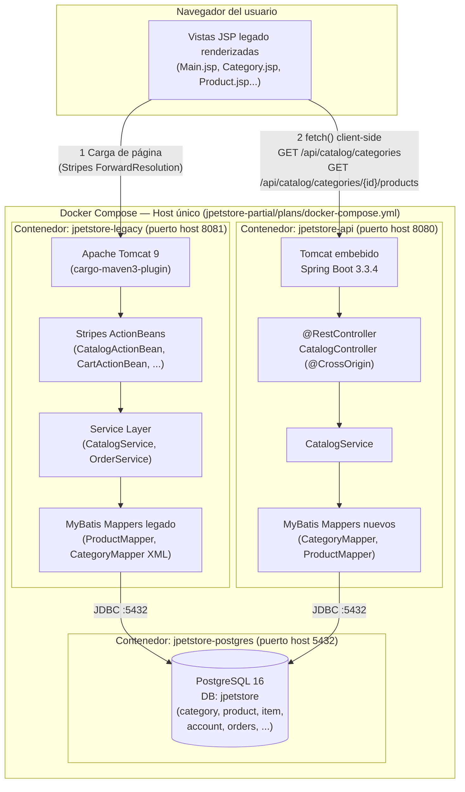
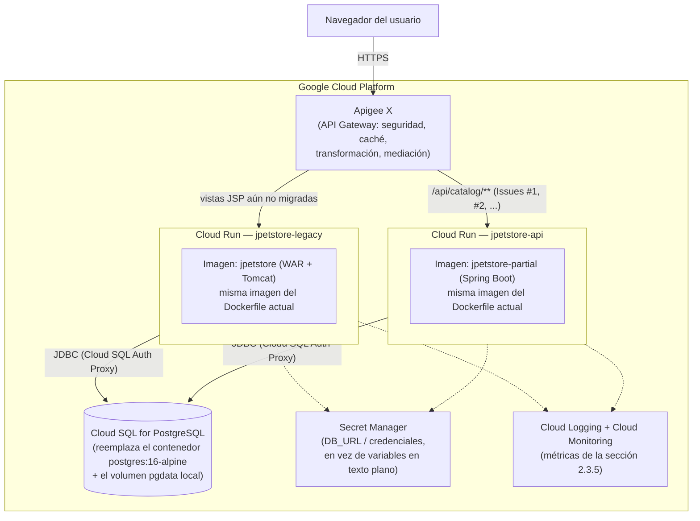
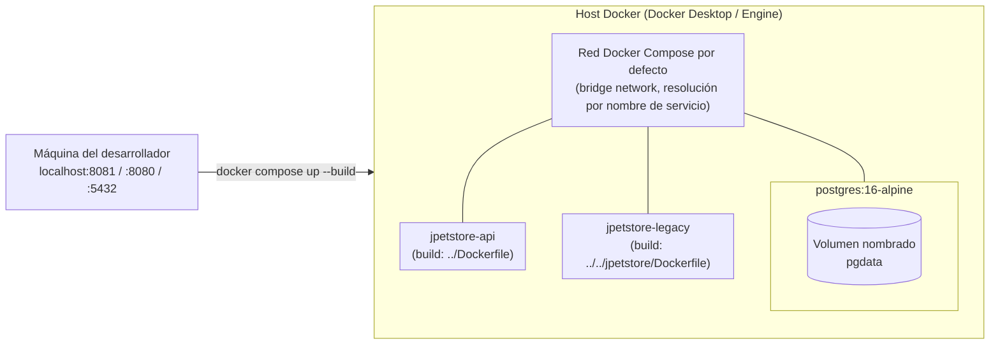
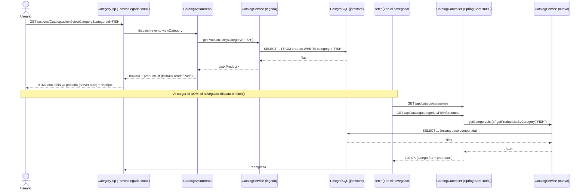
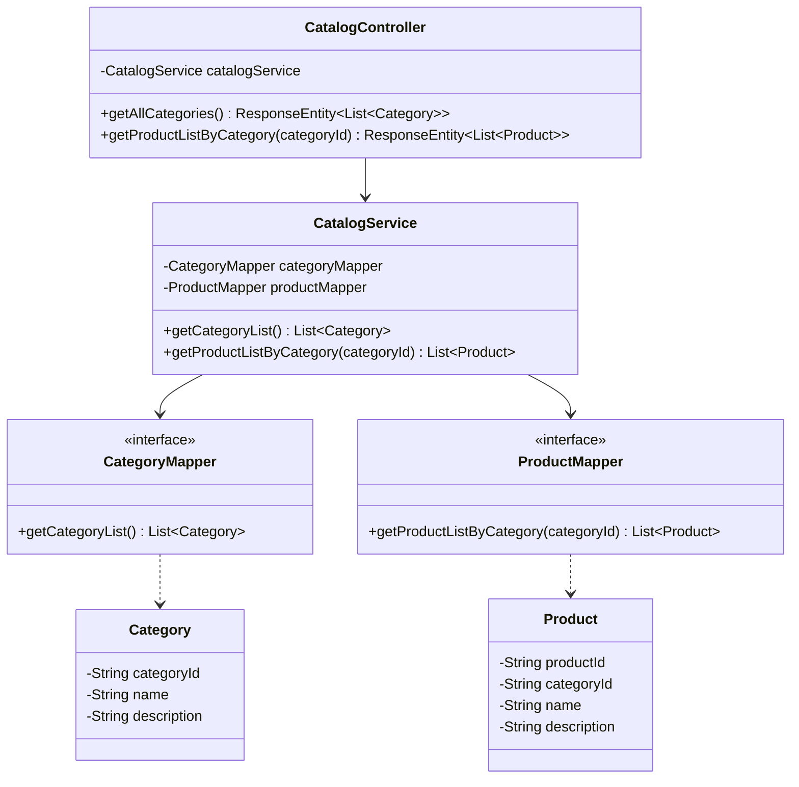

# Pregunta 1 — Arquitectura To-Be y Experimento

## 1. Arquitectura To-Be y Experimento

### 1.1 Diagrama de despliegue



**Componentes y su interacción**

| Elemento | Rol | Interacción principal |
|---|---|---|
| `jpetstore-legacy` (Stripes + JSP, Tomcat 9) | Sistema de registro original: maneja sesión, carrito, cuentas, órdenes y renderiza el "shell" HTML/CSS que el usuario ya conoce. | Recibe requests HTTP del navegador vía `/actions/*.action`; para las vistas ya modernizadas (Categoría) delega la obtención de datos de catálogo al navegador, que a su vez llama a la API nueva. |
| `jpetstore-api` (Spring Boot 3, Java 17) | Nuevo backend API-first, sin estado, expone JSON. Piloto: `Product Catalog Service`. | Responde `GET /api/catalog/categories` y `GET /api/catalog/categories/{categoryId}/products` con `@CrossOrigin(origins = "*")` para ser consumido desde el origen del legado. |
| `jpetstore-postgres` (PostgreSQL 16) | Única fuente de datos compartida entre ambos sistemas durante la transición. | Ambos backends abren su propio `DataSource`/pool de conexiones contra la misma base `jpetstore`. El *seed* de datos se toma directamente de los scripts reales del proyecto legado (`jpetstore-hsqldb-schema.sql`, `jpetstore-hsqldb-dataload.sql`), montados de solo lectura en `docker-entrypoint-initdb.d`. |
| Navegador (JS `fetch()`) | Actúa como el "orquestador" cliente que decide si pinta con datos server-side (fallback) o con datos frescos de la API. | En `Category.jsp` se agregó JS que llama a los dos endpoints migrados y reemplaza el `<tbody>` renderizado por Stripes si la API responde correctamente. |

### 1.2 Patrones y tácticas escogidas — justificación

- **Strangler Fig (patrón de migración incremental):** el legado sigue vivo y sirviendo todas las funciones no migradas (cuenta, carrito, órdenes); solo el catálogo de solo-lectura se "estrangula" hacia la API nueva. Se eligió porque minimiza el riesgo (no se toca el camino de pago/transacciones) y permite migrar vista por vista.
- **Shared Database (táctica transicional, no destino final):** se usa una sola base PostgreSQL para ambos sistemas durante el experimento. Es una táctica deliberadamente **transitoria**: reduce el costo de sincronización de datos mientras se valida la arquitectura, a costa de acoplar el esquema entre los dos sistemas (anti-patrón conocido a largo plazo — ver recomendaciones en la sección de post-experimento).
- **Layered Architecture (Controller → Service → Mapper) + Data Mapper (MyBatis):** se reutiliza intencionalmente la misma disposición en capas del legado en el nuevo backend para que el conocimiento del equipo sea transferible y el mapeo de código sea casi 1:1 (ver sección 2.3.2).
- **Externalización de configuración vía variables de entorno:** tanto `application.yml` (Spring Boot) como el `applicationContext.xml` del legado (modificado con `<context:property-placeholder system-properties-mode="ENVIRONMENT">`) resuelven `DB_URL`/`DB_USERNAME`/`DB_PASSWORD` desde el entorno. Esto permite que el mismo artefacto (WAR/JAR) corra en local (`localhost`) o en contenedores (`postgres` como *service name* de Docker Compose) sin recompilar — táctica de **portabilidad de despliegue**.
- **CORS habilitado explícitamente (`@CrossOrigin`)** en el controlador nuevo: táctica de **interoperabilidad** que permite que el JS inyectado en el origen del legado (`localhost:8081`) consuma la API en otro origen (`localhost:8080`) sin un proxy inverso intermedio — aceptable para el piloto, pero candidato a resolverse con un API Gateway en producción (ver 1.3).

### 1.3 ¿Qué prácticas observadas en los recursos Apigee se podrían extrapolar a la arquitectura to-be? ¿Por qué?

Apigee ofrece una capa de abstracción que ayuda a reducir la complejidad de acceder a sistemas back-end legados a través de APIs, junto con características de **seguridad, caché, transformación de datos y mediación**. Extrapolando cada una de esas cuatro capacidades a nuestra arquitectura to-be (donde `jpetstore-api` ya es, literalmente, una API que da acceso a un sistema back-end legado — la base PostgreSQL compartida con `jpetstore-legacy`):

1. **Capa de abstracción sobre el back-end legado:** hoy `CatalogController` ya cumple parcialmente este rol (oculta el esquema `product`/`category` detrás de un contrato JSON), pero lo hace **sin gateway intermedio** — el navegador llama directo al puerto 8080 del contenedor Spring Boot. La práctica a extrapolar es interponer un Apigee (o equivalente) *delante* de `jpetstore-api`, para que ni el JS del legado ni futuros consumidores (móvil) conozcan la topología real de contenedores/puertos.
2. **Seguridad:** hoy el único control es `@CrossOrigin(origins = "*")` (abierto a cualquier origen, sin autenticación). Apigee permitiría exigir *API key*/OAuth2 y restringir el origen exacto (`http://localhost:8081`), sin tocar el código de `CatalogController`.
3. **Caché:** las dos consultas migradas (`/categories`, `/categories/{id}/products`) son de solo lectura y cambian con poca frecuencia (igual que los datos semilla del legado). Es un caso ideal para *response caching* en el gateway, evitando ir a PostgreSQL en cada `fetch()` del JSP — hoy esa responsabilidad no existe en ninguna capa.
4. **Transformación de datos:** si a futuro el frontend legado necesitara un formato distinto al que exponemos hoy (por ejemplo, envolver la lista en `{ "items": [...] }` para paginar), Apigee permite transformar la respuesta en el gateway sin duplicar lógica en `CatalogController` ni romper otros consumidores que ya dependan del formato actual.
5. **Mediación:** a medida que se migren los Issues #3–#6 (detalle de producto, ítems, búsqueda), el gateway podría enrutar/orquestar llamadas a distintos servicios backend (o incluso al legado directamente para lo aún no migrado) bajo una única URL pública — exactamente el rol de "mediador" entre cliente y los múltiples sistemas backend que coexisten durante el Strangler Fig.

**Por qué aplica puntualmente a este proyecto:** nuestra arquitectura to-be ya tiene, en esencia, el problema que Apigee fue diseñado para resolver — un back-end legado (la base compartida y `jpetstore-legacy`) al que se accede a través de una API nueva. Hoy esa API está expuesta "cruda" (sin seguridad real, sin caché, sin mediación); las cuatro capacidades citadas en el material del curso son exactamente las que faltan antes de llevar este piloto a un entorno real.

---

## 2. Pre-experimento

### 2.1 Propósito

Validar, con un piloto acotado y de bajo riesgo (catálogo de solo lectura), si la estrategia híbrida **Strangler Fig + Base de Datos Compartida + API-first** permite:

1. Modernizar funcionalidad del monolito legado (Stripes/JSP/HSQLDB embebida) hacia una arquitectura desacoplada (Spring Boot/REST/PostgreSQL) **sin interrumpir** el sistema legado en producción.
2. Que ambos sistemas (legado y nuevo) puedan operar **simultáneamente contra una única base de datos** sin conflictos de esquema ni de datos.
3. Que el frontend legado pueda "consumir" progresivamente la nueva API vía JavaScript sin rediseñar la UI existente.
4. Producir evidencia cuantitativa temprana (no solo cualitativa) de las mejoras esperadas en desempeño y mantenibilidad antes de comprometer un esfuerzo de migración mayor a los 6 endpoints completos del catálogo.

### 2.2 Requisitos escogidos (n = 2, para un equipo de 4 integrantes)

| # | Requisito | Estado | Responsable |
|---|---|---|---|
| **R1** | Migrar la persistencia del legado de HSQLDB embebida a **PostgreSQL compartido** (reemplazo del `dataSource` en `applicationContext.xml`, conservando 100% de la lógica MyBatis/Stripes) | ✅ Implementado | JuanHerreraP (persistencia) |
| **R2** | Modernizar el **catálogo de productos** hacia REST: `GET /api/catalog/categories` (Issue #1) y `GET /api/catalog/categories/{categoryId}/products` (Issue #2), consumidos desde `Category.jsp` vía `fetch()` (Issue #7, parcial) | ✅ Implementado y validado end-to-end | Este equipo de trabajo (sesión actual) |

Se seleccionaron estos dos porque son los únicos requisitos de la tabla de requisitos (issues de `jpetstore-partial`, #1–#8) que ya cuentan con **código real, ejecutado y verificado**, lo que permite responder este punto con evidencia y no solo con intención.

### 2.3 Descripción

#### 2.3.1 Tecnología y framework destino

| Elemento estructural | Legado | Destino |
|---|---|---|
| Lenguaje/plataforma | Java (JDK variable, `openjdk:25` en Docker) | Java 17 LTS |
| Framework web | Stripes 1.6.0 (ActionBean + JSP) | Spring Boot 3.3.4 (`@RestController`) |
| Contenedor de aplicación | Apache Tomcat 9 vía `cargo-maven3-plugin` (instala Tomcat en tiempo de ejecución) | Tomcat embebido en el propio JAR (`spring-boot-starter-web`) |
| Persistencia/ORM | MyBatis 3.5.19 + `mybatis-spring`, `SqlSessionFactoryBean` declarado a mano en XML | `mybatis-spring-boot-starter`, autoconfigurado por convención (`@MapperScan`) |
| Base de datos | HSQLDB embebida (`jdbc:embedded-database`) → PostgreSQL 16 (ya migrado) | PostgreSQL 16 (misma instancia, compartida) |
| Configuración | XML de Spring (`applicationContext.xml`), hardcodeada | `application.yml` con *property placeholders* (`${VAR:default}`), 12-factor |
| Empaquetado | WAR desplegado en Tomcat externo | JAR ejecutable (`java -jar app.jar`), imagen Docker multi-stage |
| Frontend | JSP + Stripes taglibs, renderizado 100% servidor | Mismo JSP/CSS, pero con JS `fetch()` inyectado que reemplaza el `<tbody>` con datos de la API (Strangler Fig a nivel de presentación) |

#### 2.3.2 Mapeo entre elementos del legado y elementos modernizados

| Elemento legado | Elemento modernizado | Descripción del mapeo |
|---|---|---|
| `CatalogActionBean.viewCategory()` (evento Stripes) | `CatalogController.getProductListByCategory(String categoryId)` | Ambos delegan en el mismo método de servicio (`getProductListByCategory`); cambia el mecanismo de invocación (evento HTTP con *forward* a JSP) por invocación REST con respuesta JSON. |
| `CatalogService` (legado, con `@Transactional`, componente Spring) | `CatalogService` (nuevo, `@Service` Spring Boot) | Misma responsabilidad y firma de métodos; el nuevo servicio es más delgado porque no maneja estado de sesión ni carrito. |
| `ProductMapper.xml` (legado, columnas en mayúsculas por convención HSQLDB) | `ProductMapper.xml` (nuevo, columnas en minúscula por convención PostgreSQL) | Mismo query semántico (`SELECT ... FROM product WHERE category = ?`), pero se ajustan los alias de columna (`productid AS productId`, etc.) al *case-folding* de PostgreSQL y a `map-underscore-to-camel-case: true`. |
| `Product`/`Category` (dominio legado, con lógica de `trim()` en setters) | `Product`/`Category` (dominio nuevo, POJO simple) | Se simplifican los setters (no se requiere `trim()` porque PostgreSQL no rellena `VARCHAR` con espacios como sí lo hacía HSQLDB en algunos casos). |
| `Category.jsp` con `<c:forEach items="${actionBean.productList}">` (render 100% servidor) | Mismo `Category.jsp` + bloque `<script>` con `fetch()` a los dos endpoints migrados | El HTML servidor se conserva como **fallback** (si la API falla, se muestran las filas ya renderizadas); si la API responde, el JS reemplaza `#product-list-body` — patrón de **mejora progresiva** (*progressive enhancement*), no de reemplazo total. |
| `applicationContext.xml` → `DriverManagerDataSource` con URL/usuario/clave *hardcodeados* a `localhost` | Mismo bean, pero con `<context:property-placeholder system-properties-mode="ENVIRONMENT">` y valores `${DB_URL:...}` | Permite que el mismo WAR apunte a `localhost:5432` en desarrollo local o a `postgres:5432` (nombre del servicio en Docker Compose) sin recompilar. |

#### 2.3.3 Ejemplos de código legado vs. modernizado

**(a) Persistencia — antes (HSQLDB embebida, según `POSTGRESQL_SHARED_PERSISTENCE_PLAN.md`) vs. después (PostgreSQL compartido, código real en `jpetstore/src/main/webapp/WEB-INF/applicationContext.xml`)**

```xml
<!-- ANTES (legado original, HSQLDB embebida en memoria) -->
<jdbc:embedded-database id="dataSource" type="HSQL">
    <jdbc:script location="classpath:database/jpetstore-hsqldb-schema.sql" />
    <jdbc:script location="classpath:database/jpetstore-hsqldb-dataload.sql" />
</jdbc:embedded-database>
```

```xml
<!-- DESPUÉS (implementado — apunta a PostgreSQL compartido, parametrizable por entorno) -->
<context:property-placeholder ignore-unresolvable="true" system-properties-mode="ENVIRONMENT" />

<bean id="dataSource" class="org.springframework.jdbc.datasource.DriverManagerDataSource">
    <property name="driverClassName" value="org.postgresql.Driver" />
    <property name="url" value="${DB_URL:jdbc:postgresql://localhost:5432/jpetstore}" />
    <property name="username" value="${DB_USERNAME:jpetstore}" />
    <property name="password" value="${DB_PASSWORD:jpetstore_pass}" />
</bean>

<jdbc:initialize-database data-source="dataSource" ignore-failures="DROPS">
    <jdbc:script location="classpath:database/jpetstore-hsqldb-schema.sql"/>
    <jdbc:script location="classpath:database/jpetstore-hsqldb-dataload.sql"/>
</jdbc:initialize-database>
```

*Explicación:* se reemplaza la base embebida por una conexión JDBC real a PostgreSQL, pero se reutilizan **los mismos scripts SQL del legado** para crear el esquema e insertar los datos semilla — esto es clave para el requisito de "una sola base compartida": ambos sistemas parten del mismo *source of truth* de datos.

**(b) Catálogo — código legado (`CatalogActionBean.java`, evento Stripes) vs. código modernizado (`CatalogController.java`, Spring Boot)**

```java
// LEGADO — org/mybatis/jpetstore/web/actions/CatalogActionBean.java
public ForwardResolution viewCategory() {
  if (categoryId != null) {
    productList = catalogService.getProductListByCategory(categoryId);
    category = catalogService.getCategory(categoryId);
  }
  return new ForwardResolution(VIEW_CATEGORY); // reenvía a Category.jsp, que renderiza server-side
}
```

```java
// MODERNIZADO — com/example/jpetstore/controller/CatalogController.java
@GetMapping("/categories/{categoryId}/products")
public ResponseEntity<List<Product>> getProductListByCategory(@PathVariable String categoryId) {
    List<Product> products = catalogService.getProductListByCategory(categoryId);
    return ResponseEntity.ok(products); // responde JSON, sin estado de sesión ni forward a vista
}
```

*Explicación:* la lógica de negocio (`catalogService.getProductListByCategory`) es idéntica en espíritu; lo que cambia es el **canal de entrega** — de un *forward* HTML a una respuesta JSON desacoplada de la vista, consumible por cualquier cliente (JS, móvil, etc.).

**(c) Frontend — antes (`Category.jsp`, render 100% servidor) vs. después (mismo JSP + `fetch()`)**

```jsp
<%-- ANTES: únicamente EL/JSTL, sin JS --%>
<c:forEach var="product" items="${actionBean.productList}">
  <tr>
    <td><stripes:link ...>${product.productId}</stripes:link></td>
    <td>${product.name}</td>
  </tr>
</c:forEach>
```

```html
<!-- DESPUÉS: las mismas filas quedan como fallback; JS las reemplaza si la API responde -->
<script>
document.addEventListener('DOMContentLoaded', async () => {
  var apiBaseUrl = 'http://' + window.location.hostname + ':8080/api/catalog';
  var categoryId = new URLSearchParams(window.location.search).get('categoryId') || '${actionBean.category.categoryId}';
  var responses = await Promise.all([
    fetch(apiBaseUrl + '/categories'),
    fetch(apiBaseUrl + '/categories/' + encodeURIComponent(categoryId) + '/products')
  ]);
  var categories = await responses[0].json();
  var products = await responses[1].json();
  // ... arma el <tbody> con los datos de la API (con escape HTML) ...
});
</script>
```

*Explicación:* se aplica **mejora progresiva**: si el JS o la API fallan, el usuario sigue viendo la tabla generada por Stripes (sin romper la experiencia); si la API responde, los datos vienen de la nueva arquitectura. Esta táctica reduce drásticamente el riesgo de la migración del frontend.

#### 2.3.4 Diagrama de infraestructura computacional

**Infraestructura destino (nube — Google Cloud Platform):** se eligió GCP puntualmente porque permite que el componente de *API Management* de la sección 1.3 (Apigee) sea un servicio nativo del mismo proveedor, en vez de una integración multi-nube:



| Servicio GCP | Reemplaza en el pre-experimento local | Por qué este servicio puntual |
|---|---|---|
| **Cloud Run** (uno por cada imagen: legado y API nueva) | Los contenedores `jpetstore-legacy` y `jpetstore-api` de Docker Compose | Corre contenedores existentes sin reescribirlos (mismas imágenes de los `Dockerfile` ya construidos y probados), con *scale-to-zero* y autoescalado — relevante para medir la **escalabilidad** que persigue la modernización. |
| **Cloud SQL for PostgreSQL** | El contenedor `postgres:16-alpine` + el volumen `pgdata` | Motor administrado (backups automáticos, alta disponibilidad) 100% compatible con el mismo driver JDBC (`org.postgresql.Driver`) que ya usan ambas aplicaciones — no requiere cambios de código, solo de `DB_URL`. |
| **Apigee X** | El `@CrossOrigin(origins = "*")` "crudo" de hoy | Es el componente que operacionaliza las prácticas descritas en la sección 1.3 (seguridad, caché, transformación, mediación) delante de ambos backends. |
| **Secret Manager** | Variables de entorno en texto plano (`jpetstore_pass` en el `docker-compose.yml`) | Evita credenciales de base de datos en claro en archivos de configuración versionados — brecha real que detectamos en el `docker-compose.yml` actual. |
| **Cloud Logging / Monitoring** | `docker logs` manual | Fuente de datos para las métricas de disponibilidad/latencia de la sección 2.3.5 sin instrumentar nada adicional en el código. |

**Entorno local para ejecutar el pre-experimento (Docker Compose):**



*Descripción:* un único `docker-compose.yml` (`jpetstore-partial/plans/docker-compose.yml`) orquesta 3 contenedores en la red *bridge* por defecto de Compose, donde cada servicio se resuelve por su nombre (`postgres`, no `localhost`). Los puertos se exponen al host en 8081 (legado), 8080 (API nueva) y 5432 (Postgres, para depuración con cualquier cliente SQL). El volumen `pgdata` persiste los datos entre reinicios; los scripts `jpetstore-hsqldb-schema.sql` y `jpetstore-hsqldb-dataload.sql` del proyecto legado se montan de solo lectura en `docker-entrypoint-initdb.d`, de modo que Postgres se auto-siembra en su primera inicialización sin depender de que el contenedor legado termine de arrancar. Como la configuración de ambas aplicaciones está 100% externalizada (variables de entorno), el salto de este entorno local al diagrama de Cloud Run + Cloud SQL de arriba no requiere cambiar código, solo el valor de `DB_URL` y las credenciales (que en la nube vendrían de Secret Manager, no de `docker-compose.yml`).

#### 2.3.5 Instrumentación del experimento y métricas

| Atributo de calidad deseado | Tipo de prueba | Métrica(s) | Herramienta sugerida |
|---|---|---|---|
| Desempeño / Escalabilidad | Prueba de carga sobre `GET /api/catalog/categories/{id}/products` vs. el *action* equivalente del legado | Latencia p50/p95/p99, throughput (req/s), tasa de error bajo carga | JMeter o Gatling |
| Mantenibilidad | Análisis estático comparado (legado vs. nuevo módulo) | Complejidad ciclomática, % duplicación, *code smells*, *Code Health Score* (ya proyectado en el plan: 35→85) | SonarQube |
| Confiabilidad / Consistencia de datos | Prueba de integración cruzada: mismo dato insertado/leído desde ambos sistemas contra la misma base | Igualdad de conteos de filas y valores entre lo servido por el legado y lo servido por la API (ya verificado manualmente en esta sesión: 5 categorías, 16 productos, 28 ítems idénticos en ambos) | Script de verificación / prueba de contrato (Postman, RestAssured) |
| Interoperabilidad | Prueba de disponibilidad del stack completo (arranque conjunto) | Tiempo de arranque de cada contenedor, éxito de *healthcheck*, ausencia de errores de conexión JDBC | Docker Compose healthchecks + logs |
| Usabilidad (frontend modernizado) | Prueba exploratoria / encuesta a usuarios sobre percepción de velocidad de carga del catálogo | Tiempo percibido de carga, tasa de éxito de tareas ("encontrar un producto") | Encuesta corta + *System Usability Scale (SUS)* |
| Seguridad básica | Revisión de las respuestas JSON renderizadas en el DOM | Ausencia de inyección DOM/XSS al insertar `product.name`/`productId` sin escape | Revisión manual + *code review* (ya se aplicó *HTML-escaping* explícito en el JS de `Category.jsp`) |

> El desarrollo formal de estas pruebas está fuera del alcance de esta entrega; aquí solo se enuncian el tipo de prueba y las métricas candidatas, como pide el enunciado.

#### 2.3.6 Interesados (stakeholders) involucrados en las pruebas

- **Product Owner / dueño de negocio de la tienda de mascotas:** valida que el catálogo modernizado no altere la experiencia de compra.
- **Equipo de desarrollo (los 4 integrantes):** ejecutan y analizan las pruebas de carga, SonarQube y de integración.
- **JuanHerreraP (autor de la migración de persistencia):** valida específicamente que el cambio de HSQLDB a PostgreSQL no rompió ningún flujo transaccional del legado (cuentas, órdenes).
- **DBA / responsable de datos:** valida la integridad del esquema compartido (`schema-postgres.sql`/scripts legado) y el plan de *backup* de la base compartida.
- **QA:** ejecuta las pruebas de contrato/regresión entre legado y API nueva.
- **Usuarios finales representativos:** participan en la encuesta de usabilidad del catálogo modernizado.
- **DevOps/Infra:** responsable de que el `docker-compose.yml` (y su eventual equivalente cloud) se mantenga reproducible en CI.

### 2.4 Diseño detallado

**Diagrama 1 — Secuencia: carga de la página de categoría (flujo híbrido real)**



*Explicación:* el diagrama evidencia el patrón de **mejora progresiva**: la respuesta del servidor legado ya es una página completa y funcional; el `fetch()` la "mejora" en el cliente sin que el usuario perciba una recarga. Si el paso de `fetch()` fallara (API caída, CORS bloqueado, etc.), el usuario se queda con el HTML ya renderizado por Stripes — no hay punto único de falla para la vista de catálogo.

**Diagrama 2 — Clases/módulo: capa de catálogo modernizada**



*Explicación:* refleja fielmente el código ya implementado (`CatalogController`, `CatalogService`, `CategoryMapper`, `ProductMapper`, `Category`, `Product` en `com.example.jpetstore.*`). Se mantiene la separación en 3 capas (Controller/Service/Mapper) igual que el legado, lo que reduce la curva de aprendizaje del equipo y facilita el mapeo 1:1 descrito en la sección 2.3.2.

### 2.5 Estimación de esfuerzo

**Preguntas orientadoras**

- **¿Qué técnica ágil prefiere para estimar: analogía, desagregación y/o juicio de expertos?**
  Se usa una combinación deliberada:
  - **Puntos de función (con juicio de expertos para el factor de productividad)** para los requisitos que son *transacciones de usuario final* claras (los endpoints REST de catálogo, R2), porque su tamaño funcional es fácilmente identificable en términos de datos y transacciones (ver clasificación abajo) y no dependen de "cuánto se parece a algo que ya hicimos" (aún no hay muchos endpoints migrados para comparar por analogía).
  - **Desagregación (WBS) + juicio de expertos** para el trabajo de infraestructura/migración de persistencia (R1) y para las tareas de *DevOps* (Docker Compose, *seeding*, *debugging* de build), porque no son "transacciones" del usuario sino trabajo técnico habilitante — la analogía y los puntos de función no tienen una unidad natural para tareas como "arreglar un `.gitignore` que excluía un archivo necesario" o "cambiar la imagen base de un Dockerfile".
  - No se usó **analogía pura** como técnica principal porque el equipo aún no tiene un historial de 2–3 endpoints migrados con esfuerzo real medido de forma consistente entre sí (Issue #1 y #2 son los primeros, y ya sirvieron de "ancla" para estimar por analogía los Issues #3–#6 restantes, ver tabla).

- **¿Ha clasificado las funciones del software en términos de "datos" y "transacciones"? Ventajas y desventajas.**

  Sí, siguiendo el mismo método IFPUG explicado en el curso (lectura "Puntos de historia y puntos de función" y el caso *Cost Estimate Migration for Crystal Reports*, Pulgarín, Ruiz, Mendoza & Garcés, Uniandes): se cuentan **DET** (*Data Element Type*: cada campo de datos visible para el usuario/consumidor) y **FTR** (*File Type Referenced*: cada archivo/tabla lógica que la transacción consulta o mantiene) por cada función, y se clasifican las tablas en ILF/EIF según **quién es dueño funcional del dato**.

  *Funciones de datos (dueño del dato → ILF vs. EIF):*

  | Elemento | Clasificación FPA | DET | FTR/RET | Complejidad → PF sin ajustar | Justificación |
  |---|---|---|---|---|---|
  | Tabla `category` | **EIF** (no ILF) | 3 (`categoryId`, `name`, `description`) | 1 RET | Baja → **5 PF** | `jpetstore-partial` **lee** la tabla pero no la mantiene — el dueño funcional sigue siendo el legado, vía su propio *dataload*. En un esquema compartido, el mismo dato puede ser ILF para un sistema y EIF para el otro según quién lo administra. |
  | Tabla `product` | **EIF** | 4 (`productId`, `categoryId`, `name`, `description`) | 1 RET | Baja → **5 PF** | Misma razón que `category`. |

  *Funciones transaccionales (DET/FTR por transacción):*

  | Transacción | Tipo IFPUG | FTR | DET | Complejidad → PF sin ajustar |
  |---|---|---|---|---|
  | `GET /api/catalog/categories` | **EQ** (Consulta/*External Inquiry*) | 1 (`category`) | 3 (los mismos campos de salida) | Baja → **3 PF** |
  | `GET /api/catalog/categories/{categoryId}/products` | **EQ** | 1 (`product`) | 5 (`categoryId` de entrada + 4 campos de salida) | Baja → **3 PF** |

  **Puntos de función sin ajustar (R2) = 5 + 5 + 3 + 3 = 16 PF.**

  *Factor de valor de ajuste (VAF):* siguiendo la fórmula del curso `VAF = 0.65 + 0.01 × ΣGSC` (suma de las 14 características generales del sistema, cada una 0–4). Para este piloto (bajo volumen transaccional, sin lógica de negocio compleja, pero con requisito explícito de reusabilidad e interoperabilidad entre dos sistemas) estimamos `ΣGSC ≈ 25` → `VAF = 0.65 + 0.25 = 0.90`.

  **PF ajustados (R2) = 16 × 0.90 ≈ 14 PF.**

  **Ventajas del método (datos + transacciones):**
  - Es independiente de la tecnología: permite comparar el tamaño funcional del módulo legado (HSQLDB/Stripes) contra el nuevo (Postgres/Spring Boot) con la misma vara, y se puede aplicar *antes* de escribir código (útil para presupuestar los endpoints aún no implementados, Issues #3–#6).
  - Estándar de la industria (el mismo que usó el caso Crystal Reports/PeopleSoft del curso), lo que facilita defender la estimación ante interesados no técnicos con una metodología reconocida, no solo "a ojo".
  - Descompone el tamaño en partes auditables (DET, FTR, GSC) en vez de un número global, lo que facilita revisar/discutir el conteo con el equipo.

  **Desventajas:**
  - La frontera de la aplicación es ambigua justo en este escenario: decidir si `category`/`product` son ILF o EIF depende de un juicio experto sobre "quién es el dueño" del dato en un esquema **compartido** — dos personas contando el mismo sistema podrían clasificar distinto.
  - El estándar no pesa el trabajo de infraestructura/DevOps (Docker, *fixes* de build, *pipelines*) que en este experimento terminó siendo una porción real y no trivial del esfuerzo (ver 3.2) — por eso NO usamos PF para R1 ni para las tareas de infraestructura.
  - El productividad "horas/PF" que ofrece el estándar (8–12 h/PF para productividad media, según el ejemplo de Crystal Reports visto en clase) viene calibrada para migraciones de reportes en tecnología legada (Crystal Reports → PeopleSoft); aplicarla sin ajuste a un stack moderno con alta reutilización de andamiaje (Spring Boot + MyBatis, patrón ya resuelto en el Issue #1) sobreestima el esfuerzo real, como se ve en la sección 3.2.

**Tabla de estimación**

| Ítem | Técnica | Tamaño | Cálculo | Estimación |
|---|---|---|---|---|
| R1 — Migración de persistencia a PostgreSQL compartido | Desagregación + juicio de expertos | 5 subtareas (dependencias, datasource, scripts, pruebas, *wiring* Docker) | — | **10 h** |
| R2 — `GET /categories` + `GET /categories/{id}/products` (backend) | Puntos de función (DET/FTR/VAF) | 16 PF sin ajustar × VAF 0.90 = 14 PF ajustados | 14 PF × 3 h/PF (productividad alta, justificada por reúso del andamiaje del Issue #1 — no el 8–12 h/PF por defecto del estándar, calibrado para Crystal Reports) | **≈ 42 h** |
| R2 — Integración `fetch()` en `Category.jsp` (frontend) | Desagregación | 1 tarea (fetch + *escaping* + *fallback*) | — | **4 h** |
| Orquestación Docker Compose (3 servicios + *seed* + *healthchecks*) | Desagregación | 1 tarea | — | **6 h** |
| Verificación end-to-end (build, *debugging* de Dockerfiles/gitignore, pruebas manuales) | Juicio de expertos | 1 tarea | — | **6 h** |
| Documentación (planes, README) | Juicio de expertos | 1 tarea | — | **2 h** |
| **Total estimado** | | | | **≈ 70 h** |

---

## 3. Post-experimento

### 3.1 Recomendaciones

**¿La arquitectura to-be (y su implementación) hacen viable la modernización desde el punto de vista técnico? → SÍ.**

Justificación (evidencia real de esta sesión, no solo teórica):

- Se ejecutaron **los tres contenedores simultáneamente** (`jpetstore-postgres`, `jpetstore-legacy`, `jpetstore-api`) contra una única base de datos.
- Se verificó que la base se siembra correctamente ejecutando **los scripts SQL reales del legado** contra PostgreSQL puro (5 categorías, 16 productos, 28 ítems), sin necesitar reescribir el *dataload*.
- Se verificó que **ambos backends leen exactamente los mismos datos** de la base compartida (el legado los renderiza server-side; la API nueva los expone como JSON).
- Se verificó que la página `Category.jsp` del legado **consume en vivo** los dos endpoints migrados vía `fetch()`, con *fallback* a render server-side si la API no respondiera.

**Desviaciones observadas respecto a lo esperado (reportadas con honestidad, para que el equipo las conozca):**

1. El `Dockerfile` del legado referenciaba una imagen base inexistente (`openjdk:25` no existe en Docker Hub) → se corrigió a `eclipse-temurin:25-jdk`.
2. El *build* del legado fallaba porque `mvnw` no tenía permiso de ejecución ni finales de línea Unix (`CRLF` de Windows rompía el *shebang*) → se agregó el mismo *fix* (`sed -i 's/\r$//' mvnw && chmod +x mvnw`) que ya existía en el Dockerfile de `jpetstore-partial`.
3. El `.gitignore` del legado tenía una regla demasiado amplia (`*.properties`) que excluía silenciosamente `.mvn/wrapper/maven-wrapper.properties`, un archivo **necesario** para que `mvnw` funcione en un clon nuevo del repositorio → se corrigió con una excepción (`!.mvn/wrapper/maven-wrapper.properties`) y se restauró el archivo.
4. El `dataSource` del legado apuntaba a `localhost:5432`, lo cual **no resuelve dentro de la red de Docker Compose** → se parametrizó vía variables de entorno (`DB_URL`, `DB_USERNAME`, `DB_PASSWORD`) con `<context:property-placeholder>`.
5. (Menor, no bloqueante) Se observaron advertencias de `StripesResources.properties` no encontrado en tiempo de ejecución del legado — no impide que la página responda 200 OK, pero es una señal de que la misma regla de `.gitignore` (#3) pudo haber excluido otros recursos necesarios; se recomienda una auditoría completa del `.gitignore` del legado.

**Recomendaciones a futuro:**

- No dejar la **base de datos compartida** como arquitectura final: es una táctica de transición válida, pero acopla el esquema de ambos sistemas. A mediano plazo, migrar hacia "*database-per-service*" con sincronización explícita (eventos, CDC) o hacia que el legado consuma también la API nueva en vez de la base directamente.
- Cerrar el `@CrossOrigin(origins = "*")` a una lista explícita de orígenes antes de cualquier despliegue no-local.
- Introducir un API Gateway (ver sección 1.3) antes de escalar a los endpoints #3–#6.
- Automatizar este `docker-compose.yml` como parte de un pipeline de CI (prueba de humo de todo el stack en cada *pull request*).
- Auditar el `.gitignore` del proyecto legado en busca de otras exclusiones no intencionales.

### 3.2 Esfuerzo real (horas)

| Ítem | Estimado | Real | Nota |
|---|---|---|---|
| R1 — Migración de persistencia a PostgreSQL | 10 h | *(a confirmar con JuanHerreraP — trabajo realizado fuera de esta sesión, no se dispone de su registro de tiempo)* | Pendiente de que el compañero reporte su tiempo real. |
| R2 — Backend catálogo (`CategoryMapper`/`ProductMapper`/`Controller`/`Service`/tests), 14 PF ajustados | 42 h (14 PF × 3 h/PF) | **≈ 1 h** | Muy por debajo de lo estimado por PF: el "andamiaje" (Controller/Service ya existente por el Issue #1) se reutilizó casi íntegramente para el Issue #2. Confirma la advertencia hecha en 2.5: incluso el 3 h/PF "de alta productividad" que ya habíamos ajustado a la baja frente al 8–12 h/PF del estándar seguía siendo conservador para una transacción que es, en la práctica, una copia del patrón del Issue #1 con otro *mapper*. |
| R2 — Integración `fetch()` en `Category.jsp` | 4 h | **≈ 1 h** | El ejemplo de código ya existía documentado en `MODERNIZATION_API_FIRST_PLAN.md`, lo que redujo el tiempo de diseño; se sumó tiempo extra solo para el *HTML-escaping* de seguridad no contemplado en el plan original. |
| Orquestación Docker Compose | 6 h | **≈ 1.5 h** | El `docker-compose.yml` base ya existía parcialmente en `jpetstore-partial`; se extendió para 3 servicios en vez de crearse desde cero. |
| *Debugging* de build del legado (imagen base, permisos `mvnw`, `.gitignore`) | *(no estimado — desviación no anticipada)* | **≈ 2 h** | Esfuerzo no contemplado en la estimación original porque no se conocían estos defectos hasta ejecutar el *build* real; justifica por qué la estimación por PF/desagregación debe reservar contingencia para "husmear" el estado real de un repositorio legado antes de comprometerse con un número. |
| Verificación end-to-end y documentación | 8 h | **≈ 1.5 h** | Se benefició de que las pruebas de humo (curl a los endpoints, conteos en PostgreSQL) son rápidas de ejecutar una vez el stack está arriba. |
| **Total** | **≈ 70 h** | **≈ 7 h** (sin contar R1, pendiente) | La brecha principal es que la estimación por PF usó la productividad "de referencia" del estándar/caso Crystal Reports en vez de calibrar con la productividad real y ya observada del propio equipo tras el Issue #1. La lección para el equipo: **una vez migrado el primer endpoint de un patrón repetible, la estimación de los siguientes debe hacerse por analogía frente al esfuerzo real ya medido (no recalculando PF con la productividad genérica del estándar), reservando los puntos de función para presupuestar trabajo nuevo/no visto.** |

> El equipo debe reemplazar la fila de R1 con el tiempo real reportado por JuanHerreraP para tener el total real completo.

### 3.3 Enlace del repositorio del código modernizado

- Backend nuevo (API-first, Spring Boot): **<https://github.com/CarlosDBayona/jpetstore-partial>** (público)
- Legado con persistencia migrada a PostgreSQL: **<https://github.com/CarlosDBayona/jpetstore-old>** (público)

Ambos repositorios son públicos; si el equipo decide hacerlos privados, deben compartirse con el usuario de GitHub `modernizacionsoft` según lo solicitado en el enunciado.
